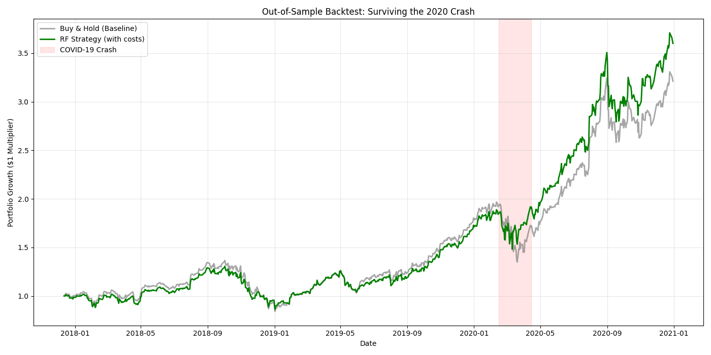

# Quantitative Equity Strategy: Regime-Aware Random Forest

## Overview
This project is an end-to-end quantitative machine learning pipeline designed to predict daily equity movements. Rather than attempting to predict continuous price values (regression), this model uses a **Random Forest Classifier** to generate discrete trading signals (`1 = Buy/Hold`, `0 = Cash`). 

The primary objective of this project was to engineer a robust strategy that overcomes the three most common pitfalls in retail algorithmic trading:
1. **Non-Stationarity:** Models breaking down over time due to memorizing absolute dollar values.
2. **The Whipsaw Effect:** Models bleeding capital to transaction fees during prolonged bull markets due to paranoid mean-reversion signals.
3. **Out-of-Distribution Crises:** Models failing during black swan events due to a lack of macroeconomic context.

## Strategy & Architecture

### 1. Feature Engineering (Stationarity)
Raw closing prices were discarded to prevent the model from curve-fitting to specific historical price points. Instead, the model relies on strictly relative and stationary metrics:
* **Volatility:** Bollinger Band (price location relative to standard deviation bands).
* **Mean-Reversion/Momentum:** Relative Strength Index (RSI-14) and Daily Returns.

### 2. The Regime Filter & Fast Trend
To solve the "Whipsaw Effect" (where the model panic-sells during strong bull markets), dual time-frame moving averages were integrated:
* **The Macro Regime Filter (200-Day SMA):** Fed to the model as a percentage distance, allowing the algorithm to mathematically recognize when it is in a prolonged, macro bull-market and ignore short-term "overbought" signals.
* **The Fast Trend (20-Day EMA):** Exponentially weighted to react instantly to micro-momentum shifts, allowing the model to buy back in rapidly after a crash.

### 3. Macro-Economic Override (The Fear Gauge)
To prevent the model from buying into massive crashes simply because technical indicators looked mathematically "cheap," the **CBOE Volatility Index (VIX)** was merged into the feature matrix as a global panic gauge. 

### 4. Stress-Test Training Methodology
To ensure the model understood what a true market collapse looked like, it was specifically trained on data from **2005 to 2015**. This forced the Random Forest to process the extreme volatility of the 2008 Great Financial Crisis, giving it the mathematical context required to extrapolate danger during future unseen black swan events.

### 5. Hyperparameter Optimization
Instead of relying on the default Random Forest 50% democratic voting threshold, the pipeline includes a programmatic optimization script to find the threshold that maximizes the **Sharpe Ratio** (Risk-Adjusted Return), balancing the tradeoff between market participation and capital preservation.

## Out-of-Sample Backtesting (The 2020 COVID Crash)
The optimized model was subjected to a rigorous, vectorized Out-of-Sample (OOS) backtest from late-2017 to late-2020. This specific timeframe tested the model's ability to ride a massive bull run (2019) and subsequently survive the 2020 global pandemic shutdown.

*Note: Transaction costs of `0.1%` per trade were included to simulate realistic slippage and bid-ask spread.*

### Key Results (Optimal Threshold: 0.39):
* **OOS Buy & Hold Baseline Return:** 221.23%
* **OOS Strategy Return:** 260.12%
* **OOS Sharpe Ratio:** 1.45
* **Time in Market:** 727 Days
* **Time in Cash (Protective):** 42 Days

### Performance Takeaways:
* **Asymmetric Capture:** The model successfully utilized the 200-Day SMA to ride the 2019 bull market, capturing the upside while avoiding over-trading.
* **Capital Preservation:** Triggered by the spiking VIX and broken technicals, the model successfully shifted to 100% cash during the height of the COVID-19 crash in early 2020, preserving capital while the baseline plummeted.
* **Outperformance:** By sitting out for just 42 highly volatile, dangerous trading days, the strategy achieved a significantly higher final portfolio multiplier than the baseline with a much lower volatility profile (resulting in an elite Sharpe Ratio of 1.45).

## Technologies Used
* `Python` (Object-Oriented Pipeline)
* `pandas` / `numpy` (Vectorized backtesting and timezone-aware data alignment)
* `scikit-learn` (RandomForestClassifier, Class Weight Balancing, Precision Evaluation)
* `yfinance` (Data ingestion)
* `matplotlib` (Visualization)